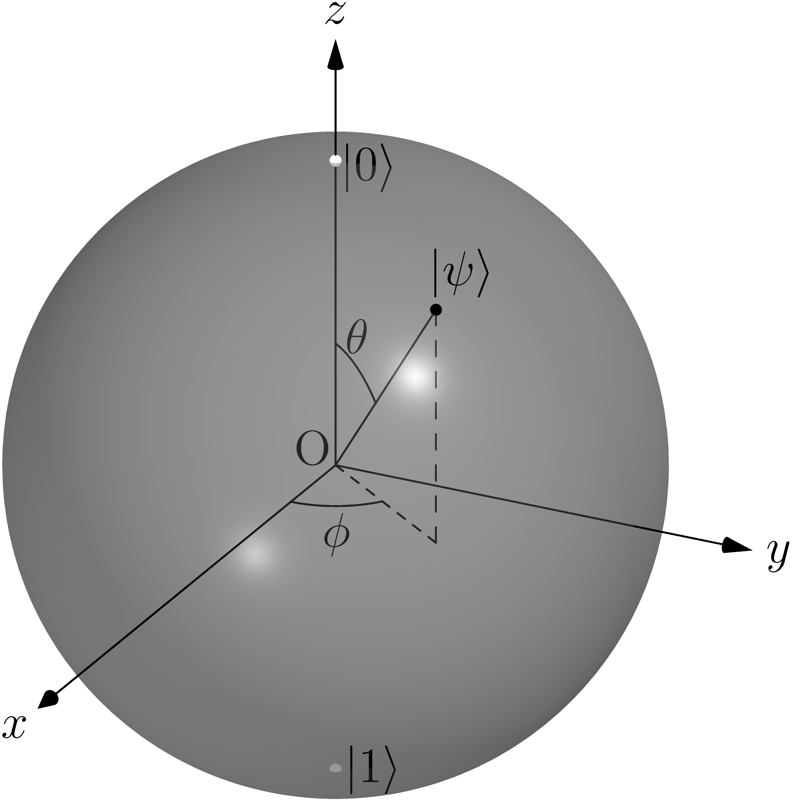
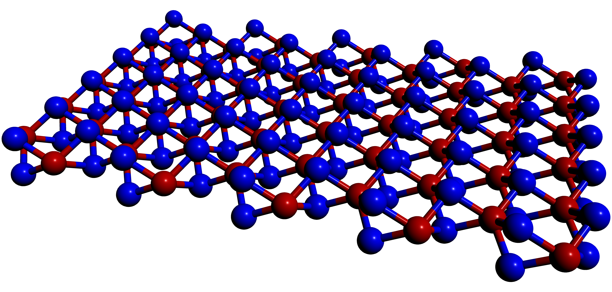

# Graphics Portfolio

Graphics Portfolio is my personal portfolio containing educational and/or scientifc graphical figures that I have been developing along the way. You may find graphics generated with different programming languages such as LaTeX, Asymptote, or Mathematica.
Apart from programming languages, I have also tried a couple of things with Inkscape.

Right below you can see a selection of small projects I have concluded.

## Organization

The projects are grouped by programming languages and are inside a mother folder, having this portfolio a mother folder for each programming language or graphics editor software.
At the moment there are 4 folders named ```LaTeX```, ```Asymptote```, ```Mathematica```, and ```Inkscape```.
Each small project is contained inside a folder including the source code, a  ``.pdf`` version of the graphic including a ``.png`` one for Asymptote generated ones, and a brief technical explanation of what it represents in a descriptive PDF file.

<p align="center">
  
  
</p>

<p align="center">
  
  
</p>
